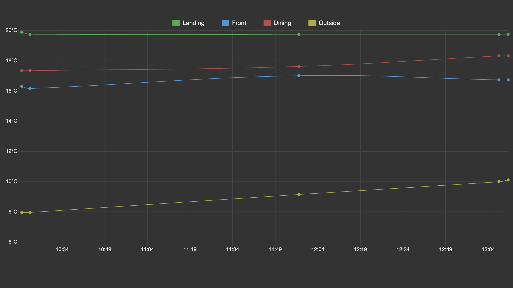

# hue



## [Getting started](https://www.developers.meethue.com/documentation/getting-started)

1. Go to: https://<hue bridge IP>/debug/clip.html
2. Enter:
   - URL: `/api`
   - body: `{"devicetype":"my_hue_app#my_user"}`
3. Before sending - press the button on the hue bridge
4. Click `POST`
5. Make note of the username (e.g. `1028d66426293e821ecfd9ef1a0731df`)
6. Enter username and bridge IP in the config
7. Create `config.json`:
    ```json
    { "ip": "<hue bridge IP>", "username": "<token>", "location": "<city, country>" }
	```
8. Add cronjob to run e.g. every hour:
    ```sh
	    0 * * * * /path/to/script/index.js -c
	```
9. Open `http://localhost/hue/index.html` in browser (requires a server)


## Links
- [Sensors API](https://developers.meethue.com/develop/hue-api/5-sensors-api) (requires hue dev account)
